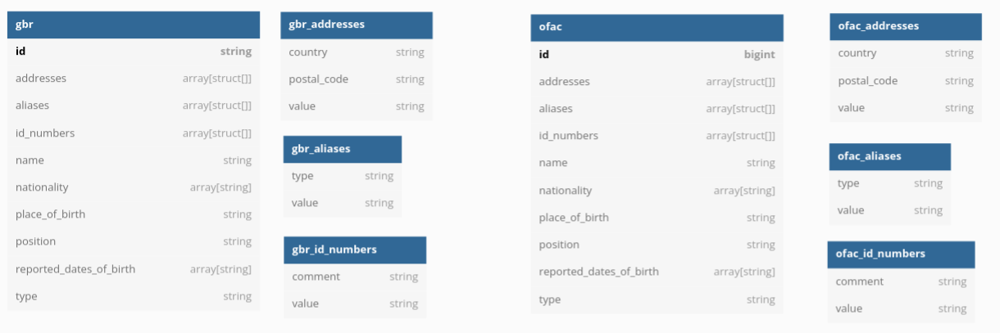

# Sayari Spark Problem

My solution to [this problem](https://gist.github.com/jvani/0bc9a6aa143c5cc8bdd74f6b3828faac).

## How to Run

1. Download the project
2. Create a python environment and install requirements
3. From project root, run `spark-submit --master local[*] app.py`
4. The result will be a csv file in the `data/output` folder

## Initial Observations

Reading the json to dataframes reveals 2 datasets with very similar structure:

The OFAC dataset is larger than GBR and contains more record types:

|            | OFAC |  GBR |
|------------|------|------|
| Individual | 4543 | 1638 |
|     Entity | 3616 |  575 |
|   Aircraft |  277 |    0 |
|     Vessel |  403 |    0 |
|  **Total** | 8839 | 2213 |

## Approach

My approach is to identify fields that make sense as identifiers and use them to compare lists. After investigating the data, I've determined that comparing `id_number` and `name` will be a reliable way to identify records in both datasets that refer to the same individual or entity. I've decided not to use `addresses` because of data quality issues. Also, parsing addresses with regex is _really_ complicated. I decided not to use `reported_dates_of_birth` or other fields due to a risk of false positives. 

## Results

The above approach identifies 796 individuals and entities that are present in both lists. I've included the output in `result.csv`, which includes the`uk_id`, `ofac_id` and `reason` fields. The `reason` field is a comma-separated string containing the reasons why those 2 entities were matched. 

## Notes

 * Some names appear more than once within both datasets. Since the duplicates all appear to refer to the same individual or entity, I decided not to exclude them from the results. 
 * Some names have leading whitespace. Trimmed and case-agnostic matching yields ~200 more results. 
 * Even though GBR and OFAC use different language for ID number comments, matching on only ID number values is very accurate. 
 * The addresses in OFAC have a problem with extra commas that would need to be handled. 
 * Addresses values in both datasets are only a city or comment in some cases. 

## Credits

No 3rd party libraries or packages were used. Database diagram made with [dbdiagram.io](https://dbdiagram.io/).
